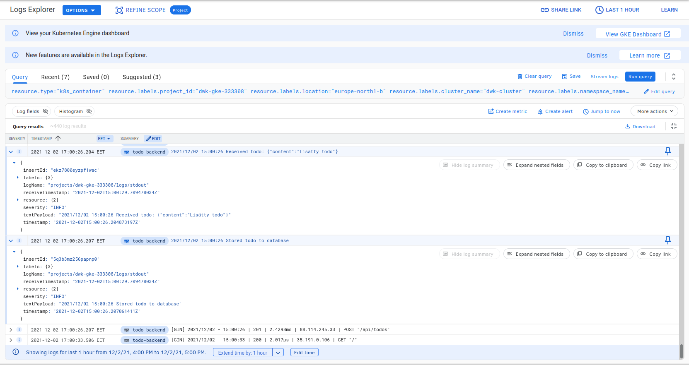

# 3.06 DBaaS vs DIY
## DBaaS
### Pros
- Minimal work required to set up and maintain
- Possibility to persist data on the cloud
- Minimal need to maintain the database as it is done by the provider
- Costs less in the long run

### Cons
- Recovering from failure can be difficult if no persistent data storage option (e.g. data center fire in Germany earlier this year)
    - This usually means more expenses
- Dependent on the provider of the service. If something breaks on providers end, you have to wait for it to be fixed

## DIY
### Pros
- Have full control of the envinronment where the database is running
- Direct control of the data, no third party involved

### Cons
- Difficult to set up and maintain
- Costs more than a cloud solution
- Data backup is difficult
- Requires dedicated staff to monitor and manage increasing costs

# 3.07 Commitment
Chose to use PersistenVolumeClaims as they were already done and didn't have enough time to figure out how to get it to working. Quick googling did reveal that the used ORM does work quite well with Cloud SQL though.

# 3.10
